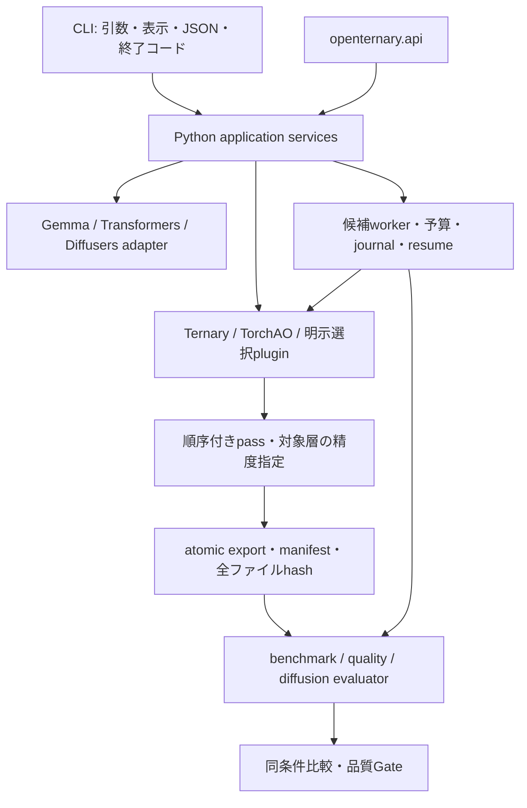

# OpenTernary CLI guide

2026-09-23 / CLI・manifest schema 1 / package 0.1.0a0

このガイドは現在の実装を説明する。実モデル・GPU・外部runtimeの受入状況は[検証表](CLI_IMPLEMENTATION_STATUS.md)、今後のGateは[CLIロードマップ](../CLI_ROADMAP.md)を参照。

## 仕組み



- `cli/main.py`は互換入口。コマンドごとのファイルに処理を分割した。
- `services/`が計画、変換、export、評価、探索を提供し、CLIとPython APIが共有する。
- `adapters/registry.py`がモデル・componentを判定し、`adapters/runtime.py`がruntime loaderを担当する。未知の重みを推測で対象にしない。
- `backends/`が方式を選択する。Ternaryは既存数学を呼び出し、TorchAOは固定versionのAPIへ接続する。
- `experiment/`がrun、`services/artifacts.py`が成果物の整合性を管理する。処理成功、ファイル整合性、モデル再読込、品質受入を別に記録する。

## 導入と診断

Python 3.11以上、開発時は3.12。coreだけでhelp、plan、doctor、backend/plugin一覧を利用できる。

```text
pip install -e .
openternary --help
openternary doctor --json
openternary backends list --json
openternary backends info torchao --json
openternary plugins --json
```

変換用依存は`pip install -e ".[ml]"`、TorchAOは`.[ml,torchao]`、Diffusersは`.[ml,diffusion]`、研究校正は`.[ml,calibration]`。既存のROCm環境を上書きせず、追加backendは対応する別環境で導入する。TorchAOは`0.18.0`、Diffusersは`0.40.0`を指定する。人工fixtureでの実package・wheel試験の証拠は[検証表](CLI_IMPLEMENTATION_STATUS.md)を参照。

通常の`doctor`はpackage metadataのみを読む。`doctor --probe-runtime --device cpu|cuda`を明示すると、固定小型tensorでFP32/BF16演算・実device・有限値を確認する。モデルはロードしない。`backends`の`installation`と`model_reload`/`native_kernel`は別の状態である。

## 計画と設定

```text
openternary plan "D:/models/example" --backend ternary --scheme absmean --json
openternary quantize "D:/models/example" --scale-granularity per_group --group-size 128 --dry-run --json
openternary calibrate --config configs/gemma4-e2b-calibration.yaml --dry-run --json
```

`plan`と`--dry-run`はモデルを実体化せず、downloadやrun作成もしない。ローカルconfigとsafetensorsヘッダから対象を列挙し、不明項目は`unknown`で返す。第三者pluginを明示選択した場合の検証関数はplugin側の責任も伴う。

YAMLは未知キー、非有限値、未対応codebook、校正methodとthresholdの矛盾を拒否する。新しいモデルIDにGemma固有revisionを継承しない。CLI override > YAML > defaultの順。

```yaml
model:
  id: D:/models/example
  adapter: auto
device: cpu
quantization:
  backend: ternary
  scheme: absmean
  weight_dtype: ternary
  activation_dtype: preserve
  scale_granularity: per_group
  group_size: 128
  passes:
    - name: clip
      options: {max_abs: 2.0}
  mixed_precision:
    model.layers.0.self_attn.q_proj.weight: preserve
```

`mixed_precision`のキーは実際の対象名に置き換える。`clip`は値を変更する前処理で、品質保持を意味しない。`noop`は内容を保持する。passの順序と二重適用を検査する。学習済み回転は通常のpassではなく、下記の専用manifestで指定する。

## 変換・保存

以下は実モデル確認に使用した操作の基本形。固定したGemma 4とpretrained Diffusersでの結果は[検証表](CLI_IMPLEMENTATION_STATUS.md)を参照する。

```text
openternary quantize "D:/models/example" --device cpu --output runs/cli-ternary --json
openternary quantize "D:/models/example" --backend torchao --scheme int8-weight-only --weight-dtype int8 --device cpu --output runs/cli-int8 --json
openternary plan "D:/models/pipeline" --component transformer --json
openternary quantize "D:/models/pipeline" --component transformer --device cpu --output runs/cli-component --json
```

TernaryとTorchAOのsnapshot変換はCPUで行う。`--device cuda`は無言でCPUへ戻さず拒否する。変換はsourceの浮動小数点dtypeを保つため、`quantize --dtype`は拒否する。表現は`--weight-dtype`、実推論dtypeはbenchmark/quality設定で指定する。

### Gemma 4 学習済み回転（研究用）

校正活性化で学習した128次元のCayley直交回転を、BF16重みへHadamard変換と同じ順番で適用してからG128三値化する。量子化対象の各Linearについて、重み側の変換と入力側の変換を一体で保存する。`quantize --rotation-manifest <JSON>`が対応し、`quality`/`benchmark`は保存済み変換を自動で読み込む。manifestには元BF16 sourceと各回転ファイルのSHA-256を記録する。選択対象外の回転、異なるsource、非直交行列は拒否する。

```text
python scripts/make_gemma4_rotation_manifest.py --source "D:/models/gemma4-bf16" --quantized "runs/q35/artifacts/snapshot" --rotation-dir runs --output runs/q35-rotations.json
openternary quantize --config runs/q35.yaml --rotation-manifest runs/q35-rotations.json --output runs/q35-rotated
openternary quality runs/q35-rotated/artifacts/snapshot --config configs/gemma4-e2b.yaml --data data/quality/gemma4-e2b-quality-v2.json --split validation --max-length 128 --stride 64 --device cuda --dtype bf16 --output runs/q35-rotated-quality
```

これはBF16のfake quant snapshotであり、packed三値実行による速度・VRAM・ファイル容量の改善は示さない。回転済みsnapshotの`ternary-packed` exportは、入力変換付きruntimeがないため拒否する。35個の`q_proj`だけを対象にした結果と、正準205対象の研究合格は区別する。

Diffusersではcomponentを明示する。現在の変換対象は認識可能な2次元Linearであり、Conv重みやVAEを含むpipeline全体の低bit対応を意味しない。

```text
openternary export runs/cli-ternary --format safetensors --output runs/cli-copy --json
openternary export runs/cli-ternary --format ternary-packed --output runs/cli-packed --json
openternary export runs/cli-packed --format safetensors --output runs/cli-restored --json
openternary artifacts validate runs/cli-restored --json
openternary artifacts validate runs/cli-restored --level tensors --json
```

| Format | 現行の動作 | 制限 |
|---|---|---|
| `safetensors` | snapshot保存、packedからの復元 | fake quantは浮動小数点保存 |
| `ternary-packed` | 2bit符号、scale、shape、padding、対象外重み保存 | 三値へ正確に再構成可能な入力のみ。native推論なし |
| `torchao` | TorchAO固有stateの複製・再読込入口 | 同じTorchAO versionが必要。safetensorsへの変換は非対応 |
| `gguf` | 指定した外部converterで浮動小数点GGUFへ派生変換 | 人工Llama FP32を実reader/CPU runtimeで検証済み。任意backendの共通変換先ではない |

packedはpack/unpack後の値・dtype・shape・byte一致をCPU fixtureで検証した。scaleを含む実ファイル容量と理論容量は別に扱う。閾値校正等のsnapshotが必要なscale情報を持たず、厳密に再構成できない場合はpackを拒否する。

```text
openternary export runs/cli-ternary --format gguf --converter "D:/llama.cpp/convert_hf_to_gguf.py" --output-dtype f16 --output runs/cli-gguf --json
```

GGUF bridgeは`llama/mistral/qwen2`のmetadataを持つsafetensors sourceのみ受け付ける。出力dtypeは`f16/bf16/f32`。converterを自動取得せず、そのhashを保存する。通常exportの確認範囲はGGUFヘッダとファイルhashまで。`--converter-python`で隔離converter環境を選び、`--timeout-seconds`で上限を指定できる。timeout/中断では起動した子プロセスを回収する。固定版を使う`validate_cli_gguf.py`は実readerとCPU runtimeの証拠をartifactの外へ保存する。現在のGemma研究snapshotはこのbridgeの対象外。

保存先の既存artifactは上書きしない。一意な一時ディレクトリに保存・検証してから公開する。manifestにはschema、全ファイルhash、source/interface、設定、backend、adapter/component、pass、コードhashを記録し、再exportでも変換履歴を引き継ぐ。

## 評価・比較

LLMの既存`benchmark --suite smoke`、`quality`を維持する。品質profileとデータsplitは研究側の定義を使い、合格閾値を変更しない。

```text
openternary compare runs/baseline runs/candidate --candidate runs/candidate2 --json
openternary compare runs/baseline runs/candidate --require-acceptance --json
openternary evaluate "D:/models/pipeline" --profile diffusion-profile.json --dry-run --json
```

Diffusion profileの例:

```json
{"schema_version":1,"family":"diffusion","name":"fixed-prompt-v1","prompts":["A red cube on a white table"],"seeds":[42],"steps":20,"width":512,"height":512,"guidance_scale":3.5,"warmup":true}
```

component比較ではprofileに`"component":"transformer"`を追加し、`--component-artifact PATH`を指定する。差し替え可能な形式は現在safetensors。prompt/seed/steps/解像度、pipelineのscheduler設定を記録し、比較時に照合する。画像のhash、時間、pixel統計を保存するが、結果は`human_review_required`で品質合格にしない。

空・破損reportは失敗。LLM quality reportはschema 3で、source/interfaceの内容hash、実device、ライブラリ・OS情報を保存する。schema 2以前は観測のみ。schema 3でも同一性未解決・synthetic fixtureは品質合格にならない。未測定のRAM/VRAM/速度は`null`であり0にしない。速度順位は測定条件の同一性が確立していない場合は出さない。

## 制約付き探索

探索は明示した候補を使う。自動で研究対象モデルや評価データを変更しない。最終testを選択用に指定できない。

`space.json`の例:

```json
[{"backend":"ternary","scheme":"absmean","weight_dtype":"ternary","scale_granularity":"per_tensor"},{"backend":"ternary","scheme":"absmean","weight_dtype":"ternary","scale_granularity":"per_group","group_size":128}]
```

`profile.json`の例。datasetとbaselineはprofileファイルからの相対パスで解決する。

```json
{"schema_version":1,"name":"balanced-llm-v1","split":"validation","dataset":"validation.jsonl","baseline":"baseline-run","max_length":512,"stride":256}
```

```text
openternary optimize "D:/models/example" --search-space space.json --quality-profile profile.json --target-vram 12GiB --objective speed --max-candidates 4 --wall-seconds 3600 --gpu-seconds 3600 --max-artifact-bytes 20GiB --output runs/search --dry-run --json
```

実行時は`--dry-run`を外し、再開には同じ入力と`--resume`を使う。候補ごとに新規workerで変換・保存・再読込・測定し、journalを残す。source、設定、profile、baseline、runtime、code hash等が一致する完了候補だけを再利用する。出力や測定の改ざんを検出する。

探索内のsnapshot変換はCPU、評価は`--config`のdevice指定を使う。GPU評価を要求した場合の失敗をCPU評価成功へ読み替えない。

全候補不合格は`no_feasible_candidate`、予算停止は`budget_exhausted`。どちらもbestを公開しない。容量は100ms間隔で監視するため、その間の一時超過余地がある。CPU以外のworkerはwall timeを保守的なGPU時間として算入する。deviceのピーク値や品質の実測検証は次段階。

## JSON・終了コード

各末端コマンドで`--json`、`--quiet`、`--events-jsonl NEW_FILE`を使用できる。JSONはstdoutに1文書、通常表示はstderrへ移す。`--quiet`も結果・エラーは保持する。`--dry-run`とeventsファイル出力の併用は副作用を避けるため拒否する。

```json
{"schema_version":1,"command":"plan","exit_code":0,"execution":"planned","artifact_validation":"not_run","quality_acceptance":"not_run","result":{},"error":null}
```

`quality_acceptance`は未評価なら`"not_run"`、compareでは`{"accepted":false,"basis":"..."}`等の判定object。`execution=completed`は品質合格を意味しない。artifact検査の`file_integrity`はモデル読込の証拠ではない。

| Code | 意味 |
|---|---|
| 0 | 操作または計画成功 |
| 1 | 想定外の実行・I/O失敗 |
| 2 | 設定・引数・入力の不正/不在 |
| 3 | 非対応capability、plugin API不一致 |
| 4 | 必須依存が未導入 |
| 5 | 必要なhardware/deviceが利用不可 |
| 6 | 明示した受入条件を満たさない／適格候補なし |
| 7 | 探索予算の上限 |
| 130 | ユーザー中断 |

JSONLは`schema_version/sequence/command/run_id/stage/completed/total`を持ち、sequenceは操作内で単調増加する。不明な総量は`null`。詳細な研究runnerの進捗は既存ログにも保存する。すべての処理段階に均一な割合進捗があるわけではない。

run作成後の失敗はmetricsへ理由を残す。初期metadata作成途中の失敗も対象。既存の完了metricsがある再試行では、以前の結果を保持して`last_failure.json`に今回の失敗を残す。同時resume/finalizeはrun lockで拒否する。

## 移行表

| 旧挙動・旧例 | 現行 |
|---|---|
| モデル不在の校正が合成実験へ移行 | 通常経路は失敗。合成fixture入口はテスト専用 |
| 未知設定を黙って無視 | 設定エラー |
| `quantize --method naive` | `--backend ternary --scheme absmean`。YAMLのlegacy method=naiveは維持 |
| `quantize --dtype bf16` | 明示拒否。変換はsource dtype、推論dtypeは評価側で指定 |
| `benchmark --suite baseline` | 対応suiteをhelpで確認。既存smokeは`--suite smoke` |
| `export --format fake-quant` | `--format safetensors` |
| 無指定の`export --format gguf` | converterの明示指定と対応architectureが必要 |
| 空compareの成功 | 入力エラー、作成済みrunに失敗を記録 |
| schemaなしqualityの合格判定 | 観測結果のみ、accepted=false |
| `cache-info` | 維持。管理artifact操作は`cache list/remove`へ分離 |

## Python API・plugin

```python
from pathlib import Path
from openternary.api import load_config, build_plan

config = load_config(cli_overrides={"model.id": "D:/models/example"})
plan = build_plan(config)
```

APIには`convert_artifact`、`export_artifact`、`validate_artifact`、`benchmark`、`quality`、`compare_many`、`run_search`もある。GGUF bridgeは`openternary.export.gguf.export_gguf`、Diffusionは`services.diffusion.evaluate_diffusion`を使う。

登録先は`openternary.backends.v1`、`openternary.passes.v1`、`openternary.exporters.v1`、`openternary.evaluators.v1`のPython entry point。提供objectの`api_version=1`が必要。重複名・予約名は拒否し、一覧ではコードをloadしない。明示選択時だけloadする。pluginは別process sandboxではなく利用者のPython権限で実行される。

| Kind | v1 interface |
|---|---|
| backend | classの`spec: BackendSpec`、`validate(config)`、`convert(source, destination, config)`。変換結果は`ConvertReport`と互換、出力は共通manifestで包装 |
| pass | `plan(options, backend)`、`apply(tensor, options)`。現在はTernary向けstateless前処理、shape/dtype/device保持 |
| exporter | `validate(source_format)`、`export(source, staging_directory)`。manifest・atomic公開はサービスが担当 |
| evaluator | `validate(raw_profile)`、`evaluate(config, model, profile, run)`。品質契約は独自にversion管理 |

schema 1で不明な形式や互換性を推測変換しない。旧manifestの自動昇格はない。将来の非互換変更はschema/entry-point versionを増やす。

## cacheとオフライン検証

```text
openternary cache list runs --json
openternary cache remove runs/cli-copy --root runs --dry-run --json
```

実削除は`--execute`を明示する。指定root内のmanifestと探索journalの参照を調べ、参照中・root自体・root外を拒否する。root外からの参照は`unknown`。共有HF cacheや元モデルを自動削除しない。

```text
python scripts/validate_cli_offline.py
```

既存開発環境で実行する。空HF cache・別cwd・GPU無効・offline設定の下でLint/format/type/対象pytestを実行し、`.tmp/cli-offline-validation.json`とJUnitを出力する。以前除外した6ファイルも人工fixtureで復帰済み。一括除外はない。`OPENTERNARY_VALIDATION_ROOT`でログの保存先を指定できる。実測結果は[検証表](CLI_IMPLEMENTATION_STATUS.md)を参照。


`artifacts validate --level files`（既定）は全ファイルのhashとmanifestを検査する。`--level tensors`はsafetensors／ternary-packed／TorchAOを実際に読み、全tensorのshape・dtype・有限値・対象一覧を照合する。元のartifactは書き換えない。native packed runtimeは提供しない。

実ライブラリ検証は`python scripts/validate_cli_real.py --root <新しい検証フォルダ> --require-wheel`。追加で`--device cuda:0 --dtype bfloat16`を指定できる。人工Llama・人工Diffusion pipelineだけをローカル生成し、ネット接続なしで実行する。外部cwdから実行し、package読込先が選択環境のsite-packagesであることを検査する。再実行は新しいrootを指定する。plugin導入試験は`validate_cli_plugins.py --root <新しいフォルダ> --uv <uv実行ファイル>`。環境構築・GGUFの具体的手順は[検証記録](CLI_VALIDATION_EVIDENCE.md)を参照。
