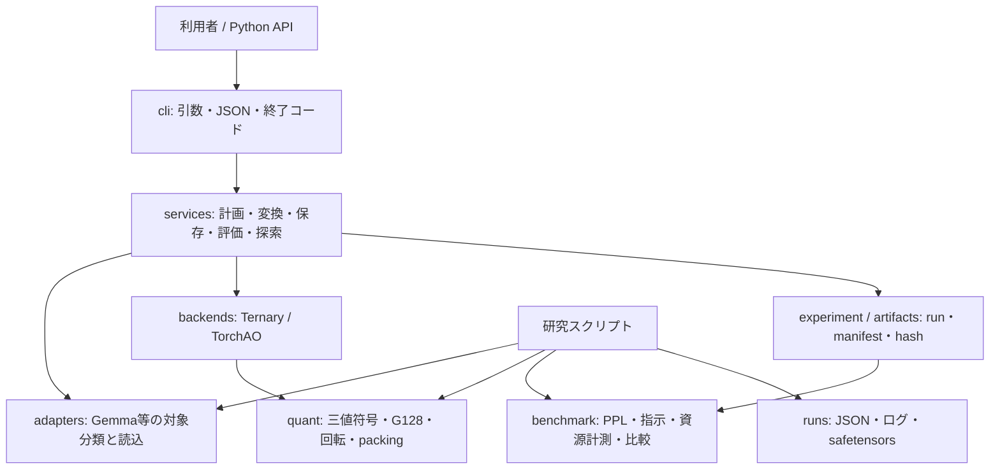

# OpenTernaryを初めて読む人・AIのための現状説明書

**基準日:** 2026-09-25（日本時間）

**照合したGit基準:** `feat/calib-threshold` の `35570322024106728539dfa02579651da6c25bee`
**この文書の目的:** プロジェクトの目的、ソフトウェアの構成、Gemma 4 E2Bの三値化研究で実証できた範囲、未達の条件、根拠の読み方を、事前知識なしで理解できるようにする。

> **最初に結論:** OpenTernaryのCLIと変換・保存・評価の仕組みは動く。しかし、目標であるGemma 4 E2Bの**正準205投影すべて**を三値化し、元のBF16モデルに近い品質で動かすことには、まだ成功していない。保存・再読込して固定品質ゲートを通過した最も広い研究候補は**28/205投影**。残り177投影はBF16である。研究実行は現在停止し、毎時の継続automationも一時停止している。

この文書は時点付きの状態記録である。実装仕様の正本は[README](../README.md)、[CLIガイド](CLI.md)、[研究受入計画](plans/p0-p7-research-acceptance.md)を参照する。研究結果の一次記録は[固定符号付きHadamard実験記録](research/gemma4-fixed-signed-hadamard-20260925.md)と、Git管理外の`runs/`にあるJSON・safetensorsである。後日の実験で結果が変わった場合は、出力ファイルと新しい記録を優先する。

## 1. そもそも何を作っているのか

大規模言語モデルは、行列の掛け算に使う大量の数値（**重み**）を持つ。通常のBF16重みは1個あたり16ビットで保存する。OpenTernaryは、その一部または全部を、`-1`、`0`、`+1`の三つの符号と少数のスケール値で表す**三値量子化**を研究するツールキットである。目標は、元モデルの言語能力をできるだけ保ちながら、低ビット表現へ変換できる方法と、それを検証する再現可能な手順を作ること。

「三値」とは、実際の重みが単純に三つの値だけになるという意味ではない。研究で使うG128方式では、同じ行の連続する128個の重みごとにスケールを1個持ち、再構成値は概念的に`符号 × スケール`になる。さらに、現在の研究候補では三値化しない投影や、embedding、正規化層、画像・音声側の重みなども残る。

最初の研究対象は**Gemma 4 E2Bのテキスト経路**である。CLI製品にはTorchAO INT8、Diffusersの一部、GGUFへの限定的な変換などもあるが、これらが動くことと「Gemma 4の三値化が成功した」ことは別の話である。

### 「成功」を混同しないための5段階

| 段階 | 何が分かるか | 現状 |
| --- | --- | --- |
| 数学・コードが動く | `-1/0/+1`への変換、再構成、回転などを実行できる | 実装・検証済み |
| 205対象を処理できる | 正準205投影すべてのhard codeを生成・保存できる | 複数方式で実施済み |
| 保存物を読み直して推論できる | 独立プロセスで完全性と再構成を確認できる | 205対象候補を含め実施済み |
| 同じ条件のBF16と比べて品質を保つ | 固定した英語・日本語・指示・崩壊ゲートを通る | **205対象では未達**。28対象の研究候補は開封済みv4/v5で通過 |
| 実用的な三値モデルとして受け入れる | 未開封の最終test、複数seed、全対象、資源計測、実行形式がそろう | 未達。native packed三値推論も未実装 |

したがって、ログに`completed`、`205 modules`、`file_integrity`、`accepted: true`のどれか一つがあっても、その一語だけで最終成功とは判断しない。**何を検証した`accepted`なのか**と、対象数・データ分割・実行形式を必ず読む。

## 2. 対象モデルと「205」の意味

固定した研究ソースは`google/gemma-4-E2B-it-qat-q4_0-unquantized`のrevision `6befbaca7398925921802abd1f277b495b78b738`。このマシンで使用したローカルBF16ソースは`D:\AI\llm model\gemma-4-E2B-it-qat-q4_0-unquantized`である。名前のとおり**QAT系のunquantizedスナップショット**であり、別のGemma 4 E2B配布版へ結果を一般化しない。「BF16との比較」は常にこの固定ソースとの比較を指す。

比較対象は全パラメータではない。Gemmaアダプタのポリシーで選んだ**テキスト側Linear投影205個**である。`q/k/v/o_proj`はattention、`gate/up/down_proj`はMLPの行列である。35層のうち層0〜14は各7個、層15〜34は各5個で、`15×7 + 20×5 = 205`。役割別には`q/o/gate/up/down`が各35個、`k/v`が各15個。対象名の正本は`runs/gemma4-all205-rotation-200steps-manifest-20260925.json`の`rotations`キーと、[対象集合の監査](TARGET_MODULE_SET_REPORT.md)で確認できる。

以前は`per_layer`系列71個が混入し、276対象として扱う誤りがあった。現在の正準集合はそれらを除外する。embedding、LM head、norm、PLE/per-layer、vision、audioなども高精度ポリシーまたは対象外として扱う。**205個すべてが三値になっても「モデルの全パラメータが三値」とは言えない。** この205投影は、モデル全パラメータ数の約35.9605%に当たるという研究記録がある。現在の「28/205」はモジュール**個数**の比率であり、モデル全体の容量削減率ではない。

## 3. 三値化と回転を、式から理解する

### 3.1 基本のG128 AbsMean

各Linear重み行を最後の次元に沿って128個ずつ区切る。各グループ`g`について、FP32で`scale_g = mean(abs(g))`を計算する。`scale_g`がゼロなら符号は全部ゼロ。それ以外は`code_i = clamp(round(weight_i / scale_g), -1, 1)`とし、推論用の再構成値を`code_i × scale_g`とする。現行の丸めはPyTorchのties-to-evenである。実装は[`src/openternary/quant/grouping.py`](../src/openternary/quant/grouping.py)、単純なグループなし版は[`ternary.py`](../src/openternary/quant/ternary.py)。

**例:** 4個の重みが`[0.2, -0.1, 0.0, 0.3]`なら平均絶対値は`0.15`。各値をスケールで割って丸め、符号を`{-1,0,+1}`へ制限する。実際の研究では4個ではなく128個単位でこれを行う。元の小数を完全復元できるわけではなく、丸め誤差が出る。その誤差が層を通して蓄積すると、文の生成能力が崩れうる。

### 3.2 なぜ重みを回転するのか

三値化前に、重みの特徴軸を直交変換で混ぜる。固定符号付きHadamard実験では、モジュール名とseed 42から決めた符号対角行列`S`と、正規化Hadamard行列`H`を使い、行ベクトル表記で`R = S H`とする。重み`W`は`W R`、そのLinearに入る活性化`x`は`x R`に変える。`R Rᵀ = I`なので、三値化**前**なら`(x R)(W R)ᵀ = x Wᵀ`で同じ関数になる。重みだけ回して入力を回さなければ、元のモデルとは違う関数になる。

固定実験の最大Hadamard幅は1024。Gemma 4に多い入力幅1536は1024で割り切れないため、実装は**H1024とH512の二つ**に分ける。幅は重み行の最後の次元によって変わる。実装は[`src/openternary/quant/rotation.py`](../src/openternary/quant/rotation.py)。この変換はBonsai 2の発想を参考にした**OpenTernary独自のGemma実験**であり、Bonsai 2の学習手順や成果を再現したという主張ではない。

もう一系統の実験では、128×128の学習可能なCayley直交回転を使用した。CLIの`quantize --rotation-manifest`は、この**学習済み回転plan**に対応する。一方、現在の28対象を構成する固定符号付きH1024の追加と複数artifactの合成は、主に専用の研究スクリプトで行った。`openternary quantize`へ28対象候補をそのまま一つの公開オプションで渡せる、と解釈しない。

### 3.3 hard code、fake quant、packedの違い

- **hard code:** `-1/0/+1`が確定済みの符号。学習中の連続値や「あとで丸める予定」という状態ではない。
- **fake quant:** 符号とスケールからBF16などの浮動小数点重みを再構成し、通常の行列演算で推論する。品質やアルゴリズムの研究には使えるが、三値専用カーネルの速度を示さない。
- **packed:** 3符号を固定幅2ビットで収納する保存形式。CLIにはpackingと整合性検証があるが、**native packed三値演算カーネルはない**。回転を要する研究モデルの`ternary-packed` exportは対応する入力変換runtimeがないため拒否される。

固定H1024研究artifactのsafetensorsには、対象ごとの`.codes`（int8）、`.scales`（FP32）、`.weight`（再構成BF16）が入る。`.weight`を持つ研究ファイルの容量やVRAMを「完成した2ビット配布モデルのサイズ」と読み替えない。

## 4. ソフトウェアはどのような構成か



| 場所 | 実際の責務 | 初めて読むときの入口 |
| --- | --- | --- |
| `src/openternary/cli/` | `inspect`、`plan`、`quantize`、`calibrate`、`benchmark`、`quality`、`compare`、`export`、`optimize`などの入口 | [`cli/main.py`](../src/openternary/cli/main.py)、[CLIガイド](CLI.md) |
| `src/openternary/services/` | CLIとPython APIから共通利用する変換、artifact検査、評価、探索 | [`services/execution.py`](../src/openternary/services/execution.py)、[`services/artifacts.py`](../src/openternary/services/artifacts.py) |
| `src/openternary/adapters/` | モデル/部品の識別、対象投影の分類、モデル読込 | [`adapters/gemma4.py`](../src/openternary/adapters/gemma4.py)、[`adapters/base.py`](../src/openternary/adapters/base.py) |
| `src/openternary/backends/` | TernaryとTorchAOなどの方式選択 | [`backends/ternary.py`](../src/openternary/backends/ternary.py) |
| `src/openternary/quant/` | 三値化、G128、回転、packing、誤差指標 | [`quant/grouping.py`](../src/openternary/quant/grouping.py)、[`quant/rotation.py`](../src/openternary/quant/rotation.py) |
| `src/openternary/calibration/` | 活性化収集、損失、最適化、checkpoint再開 | [`calibration/runner.py`](../src/openternary/calibration/runner.py) |
| `src/openternary/benchmark/` | 固定データによる品質・速度・資源測定と品質ゲート | [`benchmark/quality_runner.py`](../src/openternary/benchmark/quality_runner.py)、[`benchmark/acceptance.py`](../src/openternary/benchmark/acceptance.py) |
| `scripts/` | 正式CLIとは別の研究実験、材料化、BF16対照、再読込評価 | `evaluate_gemma4_global_rotation_q1.py`、`materialize_gemma4_fixed_hadamard_roles.py` |
| `tests/` | 数学、adapter、CLI、artifact、品質契約などの自動テスト | 対応機能名の`test_*.py` |

通常のCLIは**モデルを調べる → 対象と設定を計画する → 変換・保存する → 読み直して測る → BF16と比較する**という流れ。CLI-0〜8の製品実装と人工fixture/実モデルでの検証は[実装・検証表](CLI_IMPLEMENTATION_STATUS.md)に記録済み。2026-09-25に確認したGitHub CIでは、基準commit `35570322`のworkflowも[成功](https://github.com/ELRdn/OpenTernary/actions/runs/36134532385)している。これは**ソフトウェアの自動検査が通った**という証拠であり、205対象のモデル品質合格を意味しない。

CLIの`export`は`safetensors`、`ternary-packed`、TorchAO固有形式、限定的GGUF bridgeを提供する。ただしGGUFの実行確認は人工LlamaのCPU側など条件付きで、現在のGemma 4固定H1024研究モデルをそのまま普通のGGUF実行環境で動かせるわけではない。TorchAO INT8が一つの固定validationで合格した記録も、三値化の成功やnative INT8行列カーネルの証明ではない。

## 5. 品質をどう判定しているか

研究では、英語一般文の**PPL**（perplexity）、日本語文のPPL、64件の指示ケースの**exact match**正答率、異常反復などの**collapse件数**を使う。PPLは低いほどよく、指示正答率は高いほどよい。PPLだけ良くても、質問への答えが悪化すれば不合格になる。

これは研究用に固定した**限定的な品質ゲート**である。通過しても、長文対話、コーディング、画像・音声、日本語の自然さ、一般的な知能の維持をまとめて証明するわけではない。逆に、このゲートに落ちた候補を総合PPLだけで救済することもしない。

候補`c`と、**同じソース・トークナイザ・データ・split・dtype・推論実装・評価条件**のBF16対照`b`を比べる。固定した判定式は次のとおり（実装は[`benchmark/acceptance.py`](../src/openternary/benchmark/acceptance.py)）。

```text
英語変化率 = (候補の英語PPL - BF16の英語PPL) / BF16の英語PPL
日本語変化率 = (候補の日本語PPL - BF16の日本語PPL) / BF16の日本語PPL
指示差 = 候補正答率 - BF16正答率  （単位: パーセントポイント）
総合 = 0.35 × (-英語変化率) + 0.35 × (-日本語変化率)
     + 0.30 × (指示差 / 100)
```

**同時に**、総合が正、英語PPL悪化が2%以下、日本語PPL悪化が2%以下、指示正答率の悪化が2ポイント以下、collapseがゼロでなければならない。source/interface・データ・プロトコルのfingerprintも照合する。64問では1問の差が**1.5625ポイント**になるため、回答1〜2件の揺れが判定を変えうる。

v4、v5の品質JSONは各々calibration 32、validation 128、test 128の本文レコードと、validation/test各64件の指示ケースを持つ。ファイルは`data/quality/gemma4-e2b-quality-v4.json`と`...-v5.json`。**v4/v5は実験で既に結果を見て候補選択に使ったため、今後の最終候補の「未開封test」には使えない。** 新しい独立した最終testが必要で、校正データと重複させてはならない。既存データや閾値を都合よく変更して合格扱いにすることもできない。

固定H1024研究の現在の比較はRX 9070 XT上のBF16・**eager attention**をそろえたもの。研究runnerの`quality-runner-v1` fingerprint自体にはattention実装が符号化されていないため、fingerprint一致だけで「同条件」とは断定できない。BF16レポートの`research_execution.text_attention_implementation`と候補の`attention_implementation`がともに`eager`であることも確認する。

この比較の記録済み生成条件はseed 42、PPL文脈長128 token・stride 64、`thinking=false`、`do_sample=false`、`num_beams=1`、`max_new_tokens=64`、要求・実行dtype BF16、実device `cuda:0`。この設定を変えた測定値を同じ表へ混ぜない。

現在のeager対照と28対象候補で一致した識別子は次のとおり。これらは**同条件の証拠**であって、品質合格の代わりではない。

| 分割 | データfingerprint | quality protocol fingerprint |
| --- | --- | --- |
| v4 validation | `2edfc7751dde834173d4610ce603a890c705827d1c8926728c83f6446dbcb996` | `fa5032cbd7552f200672e771d43510be0cb30f8e4376fc0ecdffbe3c2a05ffc0` |
| v5 test | `d58586592aa54c165c94e63c952d97f82be129c92ae4a73495d2671145064d5f` | `186c62b61cd1ff21a7729d1c9a114c2a4a9e5344c4a06a5120a8aaeec2c292af` |

## 6. 実験の経緯と、2026-09-25時点の結果

| 系統 | できたこと | 品質についての結論 |
| --- | --- | --- |
| 単純なG128・校正方式 | 正準205対象を変換・保存・再読込できる。CLIのpacked往復検証もある | 205対象の品質ゲートは不合格 |
| 学習済み128次元回転 | 35個の`q_proj`候補が古いv2/v3で通過。別のv4で不合格。200-step版はv4を通過したがv5で不合格 | 局所損失の改善は全モデル品質の保証にならない |
| 全205の学習済み回転・blockwise研究 | hard codeやcheckpointを保存・検証できる | 全体の品質崩壊。保存・再読込済み205候補のv4指示正答率は0%、collapse 64/64という記録がある |
| 固定符号付きH1024を205対象へ一括適用 | 入力側にも対応回転をかけたin-memory screenを実行 | v4で英語/日本語PPL 7261.130/22939.740、指示0%、collapse 1/64。**不合格**。この方式の205対象snapshotは保存していない |
| 28対象の混合幾何候補 | hard G128をGPUで保存し、独立プロセスで複数artifactを照合・再読込 | eager BF16対照に対してv4とv5で通過。ただし28対象のみで、v4/v5は開封済み |
| 層7追加の31対象候補 | `q/k/up`をGPU保存して再読込。別の`q/k/v`も画面上で試験 | 前者はv5指示ゲートで2回不合格。後者はv5英語PPLで不合格 |

### 6.1 「28対象」の中身

28対象は一つの同質なH1024モデルではない。層0の7投影は混合校正で作った保存済みhard block、層1の`q_proj`は128次元Cayley回転の**ほぼ初期状態のstep 0**から作った保存済みhard符号である。残り20投影は固定符号付きH1024で追加した。層別の選択は次のとおり。

| 層 | 三値化した投影 | 個数 |
| --- | --- | ---: |
| 0 | `q, k, v, o, gate, up, down` | 7 |
| 1 | `q`（学習回転系）、`k, v, o, gate, up`（固定H1024） | 6 |
| 2 | `o, up` | 2 |
| 3 | `o, down` | 2 |
| 4 | `q, k, o, up` | 4 |
| 5 | `q, k, down` | 3 |
| 6 | `q, k, v, up` | 4 |
| **合計** | **7 + 6 + 2 + 2 + 4 + 3 + 4** | **28** |

保存元は`runs/gemma4-blockwise-mixed-20260925/layer0.safetensors`、`runs/gemma4-global-rotation-q1-early1-20260925.safetensors`、各層の`runs/gemma4-fixed-h1024-*-hard-gpu-20260925.safetensors`である。レポートには対象名、元ソース同一性、manifest hash、符号・スケール・再構成の検査、artifact SHA-256を記録する。**28対象を合成した単一の配布用snapshotやpacked runtimeが完成したわけではない。** 研究評価スクリプトが各保存物を読み、BF16モデルの該当Linearへ再構成重みと入力回転hookを適用する。

### 6.2 同じ環境のBF16との品質比較

以下は**eager attention**をそろえた比較。すべて64件の指示ケースでcollapse 0。値はレポートを小数第3位へ丸めたもの。

| 分割 | BF16: 英語/日本語PPL・指示 | 保存済み28対象: 英語/日本語PPL・指示 | 固定ゲート |
| --- | --- | --- | --- |
| v4 validation | 1351.609 / 1722.587・57.8125% | 1219.284 / 1366.518・60.9375% | PASS |
| v5 test | 1272.395 / 1427.770・59.3750% | 初回1137.889 / 1144.809・60.9375% | PASS |
| v5 test、別プロセスの後続2回 | 同じBF16対照 | 1138.880 / 1147.549・59.3750% | 2回ともPASS |

保存済み28対象のv4再実行は集計値と64回答hashが一致。v5初回と後続2回では**64回答中2件が変化**し、後続2回同士は一致した。全回ゲートを通ったが、完全に決定論的な推論とは言えない。また、v5を候補選択にも使ったため、これは最終的な未知データ汎化の証明ではない。主要な根拠は`runs/gemma4-twentyeight-h1024-layer6-q-k-v-up-saved-eager-v{4,5}-20260925.json`と対応する`.quality.json`、`-repeat`、`-repeat2`である。

### 6.3 なぜ31対象を採用しなかったか

28対象の上に層7の7投影を一括追加するとv4指示正答率40.625%で不合格。単独では`q/k/v/up`がv4通過したが、この4つを同時に加えると54.6875%で不合格。`q/k/up`の3つに絞った保存済み31対象候補はv4を通ったが、v5では**56.25%対BF16 59.375%**で2回同じ指示ゲート不合格だった。`q/k/v`はv4を通ったが、v5英語PPLが1350.157となりBF16の1272.395から**6.11%悪化**して2%上限を超えた。個別合格やv4合格を、組み合わせ全体・別分割の合格とみなせない。[層7の詳しい表](research/gemma4-fixed-signed-hadamard-20260925.md#layer-7-screening-and-rejected-31-target-pilots)を参照。

## 7. 速度・容量について、今言えること

同じRX 9070 XTで得たv5 quality runnerの推論時間は、BF16の2回が**82.703秒・52.834秒**、保存済み28対象の3回が**73.951秒・70.510秒・97.589秒**だった。実行間のばらつきが大きく、この数値から安定した速度比や高速化を結論できない。両者のPyTorch allocatorによるピークVRAMも約9.99 GiBで近い。28対象の研究runtimeはBF16重みへ再構成し、FP32回転をPython hookで実行するため、packed三値の速度・省VRAMを測っていない。

全205固定H1024をin-memoryで試した際には、同じrunnerの推論時間が候補1558.566秒、BF16 61.282秒という観測もある。これは**そのPython研究実装が遅かった**ことを示す。候補は品質不合格で出力長も異なり、三値方式一般や将来の専用カーネルが25倍遅いという意味ではない。容量を評価するときも、理論的な2ビット符号量、scaleの追加量、対象外BF16、研究artifactの再構成BF16、実際のファイル総量を分けて数える。

## 8. 現在の作業環境と記録の所在

| 項目 | 2026-09-25の確認結果 |
| --- | --- |
| Git | `D:\VibeCoding\OpenTernary`、branch `feat/calib-threshold`、基準HEAD `35570322`。このHEADとremoteは一致し、当該HEADのCIは成功 |
| GPU/実行環境 | Windows、AMD Radeon RX 9070 XT、Python 3.12、`torch 2.13.0+rocm10.0.0`、`transformers 5.17.0`。研究時は`.venv-rocm\Scripts\python.exe`を明示して使用 |
| BF16ソース | 上記の固定Gemma QAT-unquantized revision。source fingerprintは`54e2ebe9f8fa773600f4b7fa1b96c023f1bb90cfcf4b977e69da0b5542924402`、tokenizer等のinterface fingerprintは`3d6026effd6655743f78d95cb9195073e622b64fe8572d734006abbf6479b664` |
| 回転対象manifest | `runs/gemma4-all205-rotation-200steps-manifest-20260925.json`。SHA-256は`6bbcb65083ce84de6593a36536b64d01d5a66a799991cdb762f75664965954af` |
| 実験成果物 | `runs/`は`E:\OpenTernary\runs`へのWindows junctionで、Git管理外。別PCのcloneには自動では現れない |
| 品質データ | `data/quality/`はGit管理外。データ本文、split、fingerprintの一致を確認してから比較する |
| 自動継続とGPUジョブ | ユーザーの停止指示で毎時automationは`PAUSED`。この文書作成時点でOpenTernaryの研究Pythonジョブは稼働していない |
| Git未追跡物 | `.hf_datasets/`、`.venv-rocm/`、`data/`、既存の研究スクリプト4個が残る。掃除・Git追加・上書きをしない |
| 公開可否 | `pyproject.toml`のproject licenseは`TBD`。公開releaseの権利者判断は未完了 |

主な参照先は[README](../README.md)、[研究ロードマップ](../ROADMAP.md)、[CLIロードマップ](../CLI_ROADMAP.md)、[CLI実装状況](CLI_IMPLEMENTATION_STATUS.md)、[P0〜P7受入計画](plans/p0-p7-research-acceptance.md)、[品質研究の詳細](research/gemma4-fixed-signed-hadamard-20260925.md)。古い[`docs/README.md`](README.md)や旧Phase文書は歴史的設計・当時の進捗を含むため、日付を確認せず現在の到達点として引用しない。

## 9. 初めて引き継ぐ人・AIの読み取り手順

最初に**読み取りだけ**で次を確認する。PowerShellの例はこのマシンのパスであり、他の環境では置き換える。

```powershell
Set-Location 'D:\VibeCoding\OpenTernary'
git status --short --branch
git log -1 --oneline
Get-Item runs | Select-Object FullName,LinkType,Target
Get-CimInstance Win32_Process |
  Where-Object { $_.Name -eq 'python.exe' -and $_.CommandLine -match 'OpenTernary|gemma4' } |
  Select-Object ProcessId,CommandLine

$report = Get-Content 'runs/gemma4-twentyeight-h1024-layer6-q-k-v-up-saved-eager-v5-20260925.json' -Raw | ConvertFrom-Json
$report | Select-Object ternary_module_count,attention_implementation,candidate_summary,quality_gate
Get-FileHash 'runs/gemma4-fixed-h1024-layer6-q-k-v-up-hard-gpu-20260925.safetensors' -Algorithm SHA256
```

最後の層6artifactの期待SHA-256は`004feb4640076a02531ba4783804a48badccba1596e88ab9ebb35bff347ec328`。JSONレポートの`accepted: true`だけを見るのではなく、`ternary_module_count`、`in_memory_fixed_modules`が空か、artifact hash、BF16 control、data/protocol fingerprint、attention実装、元ソースの一致をたどる。`runs`がないcloneなら「成果物は未配置」と記録し、架空の再現結果を作らない。

**研究を再開する際の順序:** 稼働プロセスと既存出力を確認する → 固定したBF16ソース・205対象・split・品質ゲートを確認する → 新しい仮説をvalidation側で小さく検証する → 通過した組み合わせをhard codeとして保存する → 別プロセスで読み直す → 同じ環境のBF16と比較する → 最後に未開封testへ進む。**現在は停止指示が有効**なので、説明書を読んだだけでジョブやautomationを再開しない。

変更や実験を行う場合は[`AGENTS.md`](../AGENTS.md)と[`docs/AGENTS.md`](AGENTS.md)の作業規約も読む。元BF16重み、既存`runs`、データ、仮想環境、Git未追跡物を保持する。同じGPUジョブを二重起動しない。研究の品質閾値を緩めたり、v4/v5を未開封testと呼んだり、28対象の結果を205対象へ外挿したりしない。

## 10. 未解決の課題と、次に必要な証拠

1. **205対象の品質:** 残る177投影を含め、hard符号を保存・再読込した全対象候補が固定ゲートを通ること。H1024一括適用や局所MSE改善だけでは達成できなかった。層を足すほど品質が単調に改善する保証もない。
2. **独立した最終評価:** v4/v5は開封済み。新しい分離testを候補選択後に一度使い、BF16と同条件で品質・複数seed・再実行の揺れを記録すること。
3. **実行形式:** 入力回転を含む保存形式と再読込契約を単独で成立させること。現在の28対象は複数の研究artifactの合成であり、native packed三値推論ではない。
4. **速度・容量:** 品質を保つ候補ができてから、同じ実装・デバイス・warmup・prompt/出力長・回数でBF16と反復比較すること。理論サイズ、実ファイル、ピークRAM/VRAM、token/sを別々に報告すること。
5. **公開判断:** project licenseの`TBD`を権利者が決めること。コードのCI通過は公開許諾の代わりにならない。

現在の大きな研究上の論点は、**投影単位の誤差低下や単独品質合格が、全モデルの品質合格を予測しない**ことである。層7の個別4件はv4で通ったのに4件同時では落ちた。`q/k/up`の31対象候補はv4で通ったのにv5では2回同じ不合格だった。原因を「回転不足」「モデル規模」「目的関数のずれ」のどれか一つと断定する証拠はまだない。

## 11. 用語の早見表

| 用語 | このプロジェクトでの意味 |
| --- | --- |
| BF16 | bfloat16。ここでは固定ソースの重みと比較対象の推論dtype |
| 投影 / Linear | 入力ベクトルへ行列を掛ける部分。attentionの`q/k/v/o`、MLPの`gate/up/down`など |
| 正準205対象 | 研究比較のため固定した、テキスト側の205個のLinear投影。全パラメータではない |
| G128 | 各重み行を128要素ごとに分け、グループごとにスケールを持つ方式 |
| AbsMean | グループ内の絶対値平均をスケールにする基本手法 |
| hard ternary | 離散符号`-1/0/+1`が既に確定している状態 |
| fake quant | 三値符号から浮動小数点重みを再構成し、普通の行列演算で実行する研究経路 |
| Hadamard回転 | 直交変換で特徴成分を混ぜる方法。入力側にも対応変換が必要 |
| PPL | 文の予測しやすさを示すperplexity。この評価では低いほうが良い |
| exact match | 指示ケースへの回答が期待文字列と一致した割合。64問なので1問差は1.5625ポイント |
| collapse | 異常反復などの出力崩壊として検出された件数。固定ゲートはゼロを要求 |
| split | 校正・validation・testのデータ分割。候補選択に使ったtestは最終的な未開封testではない |
| fingerprint / SHA-256 | 入力・設定・成果物が同一であることを確認するhash。品質の良さ自体は保証しない |

**一文で言うと:** OpenTernaryは研究と検証の道具として成立しているが、Gemma 4 E2Bの正準205投影を品質を保って三値化する研究は継続課題であり、現在確かめられた最大の部分候補は28投影である。
